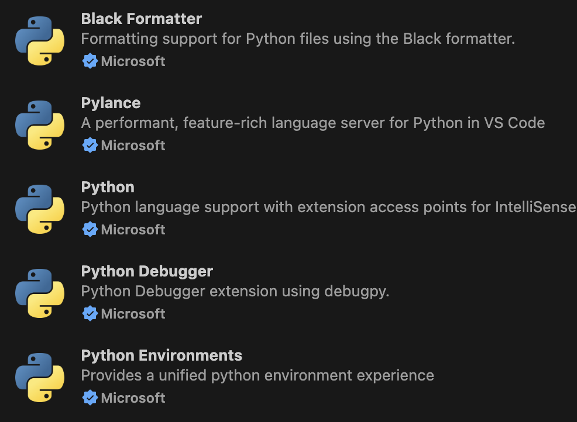

# Playwright 实现爬虫
 
## 📁 项目结构

```
crawler/
├── config.py            # 配置文件（可以忽略）
├── setup.py             # 环境安装脚本（可以单独运行，可以仔细看下）
├── gmgn_crawler.py              # 主要爬虫类
├── requirements.txt     # Python依赖
└── README.md            # 详细使用说明
```
 
## 使用方法

#### 1.安装vscode 插件: python相关插件都装一下




- setup.py    初始化环境（可以单独运行，可以仔细看下）
  1. 检查是否安装Python，以及版本
  2. 安装项目依赖， playwright  
  3. 安装Chromium
  4. 创建必要目录: data, logs, screenshots
