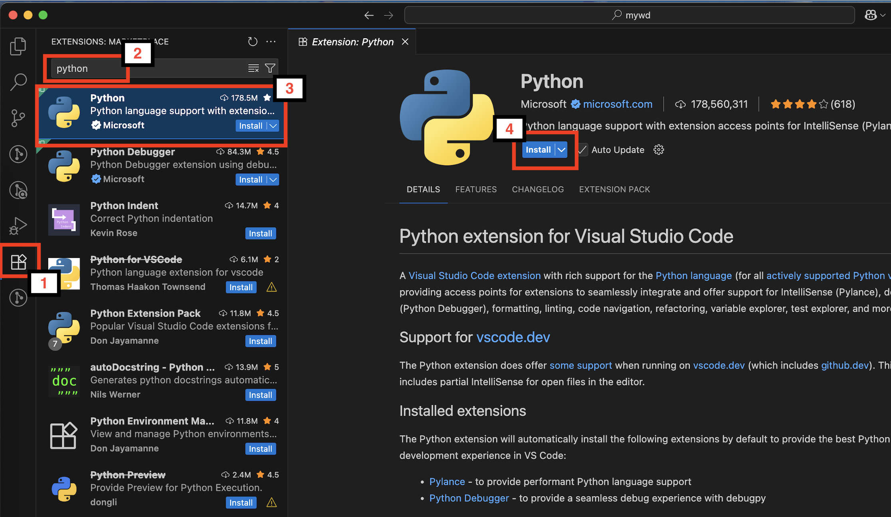

## 1. Install python

``` sh
# 1.安装python3 , 最好别用系统自带的python，用homebrew重新装一个!
brew install python

# 2.设置别名
echo 'alias python3="/opt/homebrew/bin/python3"' >> ~/.zshrc

# 3.刷新下profile
source ~/.zshrc

# 4.确认下设置
which python3
# Output: 
# python3: aliased to /opt/homebrew/bin/python3
```
--------------------------------------------------------------------


## 2. 安装playwright

1. Clone 项目 https://github.com/lichengri008/mywd


```sh
# 在项目根目录运行下列命令 (mywd目录)

# 创建虚拟环境 - 隔离
python3 -m venv venv

# 激活虚拟环境
source venv/bin/activate

# 安装playwright
# 忽略此步骤: pip install pytest-playwright

# 根据 requirement.txt 安装依赖
pip install -r playerwright-sample/requirements.txt

# 保存依赖； 每次新增或更新 pip 安装的依赖后，都重新执行一次 pip freeze 来更新 requirements.txt。
# 忽略此步骤: pip freeze > requirements.txt

# 安装 playwright 浏览器
playwright install

```

----------------------------------------------------------------------

## 3. Install VS Code Extension: Python


## 4. 运行测试

#### 4.1 headless 运行测试

```
# 执行命令， 会搜索执行 test_开头的测试文件，
pytest
# 也可以指定只执行某个测试: 比如 
pytest playerwright-sample/test-cases/test_example.py
```

#### 4.2 试一下headed mode (可以看到打开了浏览器)

```
pytest --headed
```

#### 4.3 debug测试 !
```
PWDEBUG=1 pytest -s playerwright-sample/test-cases/test_example.py
```


