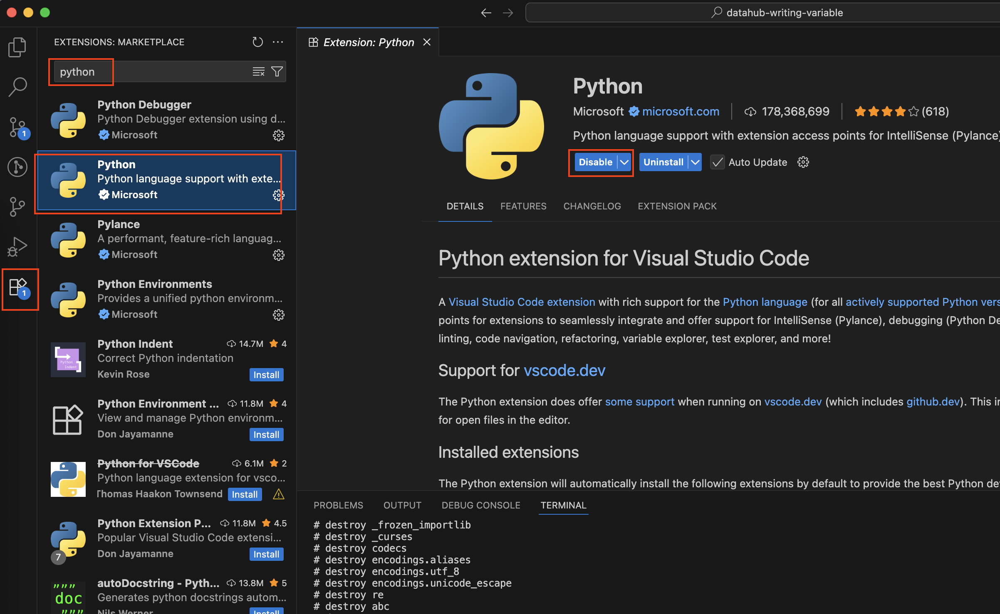
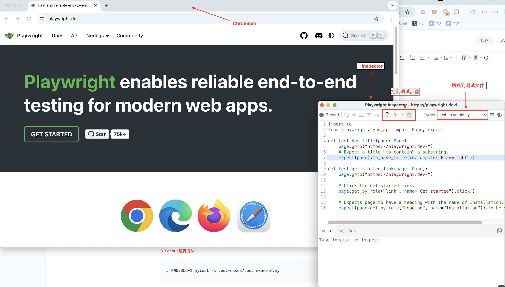

## 1. Install python

``` sh
# 1.安装python3 , 最好别用系统自带的python，用homebrew重新装一个!
brew install python

# 2.设置别名
echo 'alias python3="/opt/homebrew/bin/python3"' >> ~/.zshrc

# 3.刷新下profile
source ~/.zshrc

# 4.检查下版本
python3 --version 
# Output: Python 3.13.5 
```
--------------------------------------------------------------------


## 2. Install Pslaywright

```sh
# 切换路径
cd playerwright-sample

# 创建虚拟环境 - 环境隔离
python3 -m venv venv

# 激活虚拟环境
source venv/bin/activate

# 忽略; 安装playwright
# ignore; pip install pytest-playwright

# 根据 requirement.txt 安装依赖
pip install -r requirements.txt

# 忽略: 保存依赖； 每次新增或更新 pip 安装的依赖后，都重新执行一次 pip freeze 来更新 requirements.txt。
# ignore; pip freeze > requirements.txt

# 安装浏览器
playwright install

```

----------------------------------------------------------------------

## 3. Install VS Code Extension: Python


## 4. Run Test
#### 4.1 运行测试
```
pytest
```

#### 4.2 试一下headed mode (可以看到打开了浏览器)
```
pytest --headed
```

#### 4.3 debug测试 !
```
PWDEBUG=1 pytest -s test-cases/test_example.py
```


